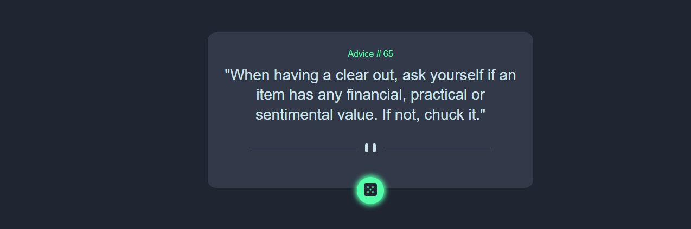
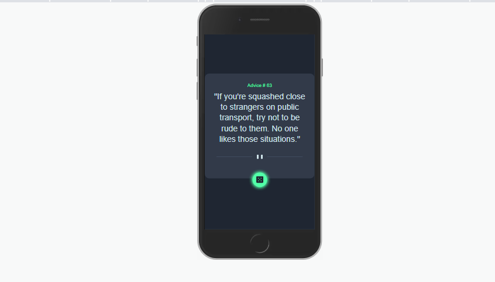

## Table of contents

  - [Screenshot](#screenshot)
  - [Links](#links)
- [My process](#my-process)
  - [Built with](#built-with)
  - [What I learned](#what-i-learned)
  - [Continued development](#continued-development)
- [Author](#author)

### Screenshot

**Desktop View**

**Mobile View**

### Links

- Live Site URL: [Click to view project](https://g-best007.github.io/Advice-Generator/)

## My process

### Built with

- Semantic HTML5 markup
- CSS custom properties
- Flexbox
- [JQuery](https://jquery.com/) - JS library

### What I learned

Leanrt how to fetch API using JQuery and how to make a button glow using box-shadow

### Continued development

I would like to work more on alot of projects that involve API using other libraries like Ajax and Promise

## Author

- Frontend Mentor - [@G-best007](https://www.frontendmentor.io/profile/G-best007)
- Twitter - [@G-best007](https://www.twitter.com/g_best007)

